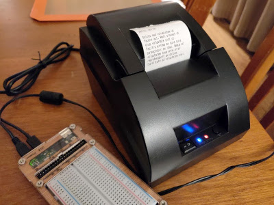

# usb_receipt_printer

Demo program to print to the POS58 USB thermal receipt printer using Python under Linux
(tested on a Raspberry Pi). This is printer labeled under different companies, but is made by 
Zijiang. See http:zijiang.com.



# Direct USB

This does not use the Linux printer driver provided by the Zijiang. Using their driver causes
the printer to be driven always in graphics mode and looks terrible for small text. It also
adds complications from the CUPS printer layer.

Instead, this demo program opens the USB port directly and communicates via the USB HID
interface. It turns it into a simple text printer. You can include Epson ESC/POS sequences.

# Linux Configuration

Special configuration is usually handled by an installation script. Here's how to do it
manually:

1. Add your user to the Linux group "lp" (line printer), otherwise you will get a user 
permission error when trying to print.

```
    sudo addgroup <myusername> lp
```

2. Add a udev rule to allow all users to use this USB device, otherwise you will also 
get a permissions error also. Example: in /etc/udev/rules.d create a file ending in .rules, 
such as `33-receipt-printer.rules` with the contents:

```
    # Set permissions to let anyone use the thermal receipt printer
    SUBSYSTEM=="usb", ATTR{idVendor}=="0416", ATTR{idProduct}=="5011", MODE="666"
```

# Python setup

This code is mainly from the example code at [https://github.com/pyusb/pyusb](https://github.com/pyusb/pyusb)

See that site to install pyusb and a USB backend. This was tested using usblib 1.0. Quick reference:

Install pyusb to your Python (suggest using virtualenv):

```
pip install pyusb
```

Install libusb 1.0:

```
sudo apt install libusb-1.0-0-dev
```
